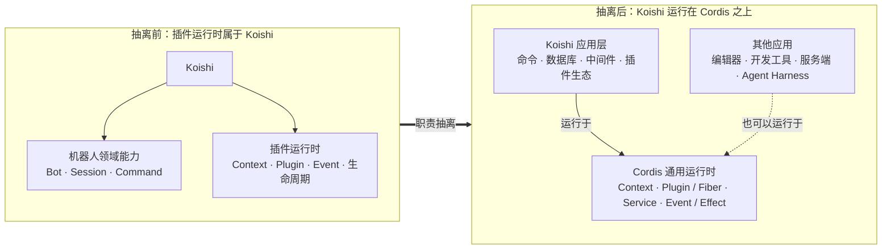
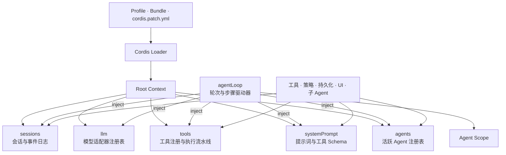
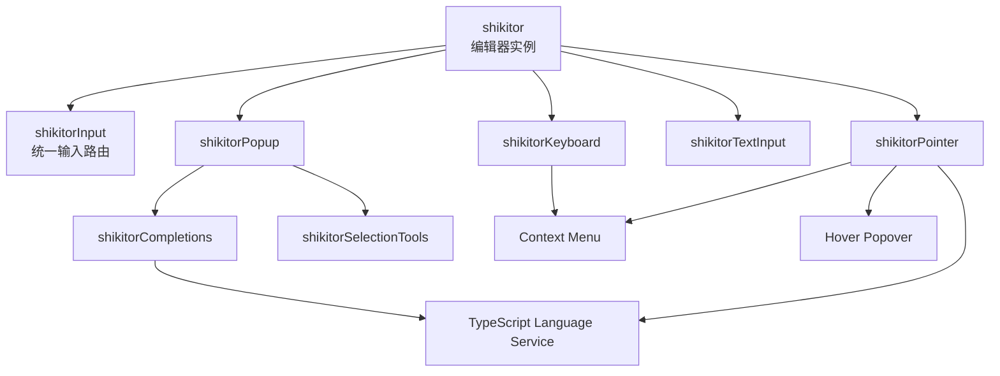
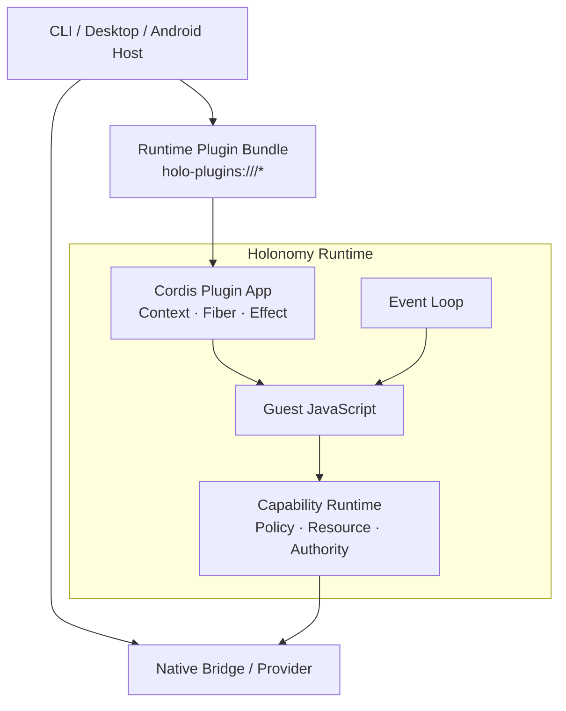

今天存档三篇关于 DeepSeek Harness（DSH）的深读长文：一篇从 Git 历史复盘 DSH 自身的 Agentic 协作流程，一篇从源码目录结构拆解 DSH 团队的项目维护之道，一篇由 Cordis 早期共建者回顾这套「一切皆插件」基建的来龙去脉。留存正文，方便之后重读。

<!--more-->
## [产品之外，我在 Git 历史中看到的——DeepSeek Harness Agentic 协作流程分析（Yu's Blog，2026-08-19）](https://skidder.top/articles/git-deepseek-harness-agentic)

存档：对 deepseek-harness 仓库 64 天开发史（12,293 次提交、686 篇决策笔记、34 个门禁脚本）的逐层拆解——治理体系、并行开发、状态机、孪生实现与可移植性清单。

### 文本留档

#### DeepSeek Harness 开发范式学习笔记

> 研究对象：deepseek-ai/deepseek-harness 自身的开发过程（2026-06-10 ~ 2026-08-13，64 天，12,293 次提交，686 篇决策笔记，11 个开发技能，34 个 verify-* 门禁脚本）。
>
> 核心事实：这是一个「一人架构 + 一支 AI 代理舰队 + 人工审查」驱动的真实生产项目——约 90-95% 代码由 AI 代理生成；治理体系本身是为「不可靠但可被机制约束的智能执行者」设计的。
>
> 核心哲学（ADR 0007《Mechanical quality gates over prose guidelines》原文）：**「本代码库主要由编码代理开发。代理对强制门禁的遵从远高于对散文约定的遵从；当代理承担劳动时，『工作量很大』不构成成本论据。」**

#### 一、如何约束 Agent 行为：避免过度开发与严重错误

##### 1.1 三层同构治理（总纲）

普通项目把规则写成 README 靠人遵守；AI 要么看不见、要么不执行、要么执行时自作主张。本项目的答案是**同一规则以三种形态同时存在**：

| 形态 | 载体 | 作用 | 例子 |
|---|---|---|---|
| 门禁（机器强制） | `scripts/verify-*` × 34 + CI | AI 绕不过 | `verify-package-invariants` `verify-agent-note-format` `verify-doc-budgets` |
| 技能（代理内化） | `.agents/skills/*/SKILL.md` × 11 | 高频工作流的「判断标准」 | `dsh-code-review` `dsh-find-simplifications` `dsh-trim-cot-leakage` |
| 决策记录（有生命周期） | `.agents/notes/` 四态笔记 | 共享「为什么」，防重复决策、防重新诉讼 | `implemented/architecture/*.md` + 必选 `Alternatives considered` |

配套两条贯穿原则：

- **信任边界显式化**：类型化同进程边界信任 TypeScript（不加冗余运行时校验）；只在解析器/配置、模型/工具 JSON、持久化、worker、进程、线缆等真实边界校验。
- **成本纪律双向不对称**：对 AI 劳动——穷尽门禁（逐文件 100% 覆盖率、knip、publint、「我们是 DeepSeek，不省真实 API 测试」）；对人类劳动——窄钩子（pre-commit 只 lint，pre-push 只增量 typecheck），CI 拥有穷尽矩阵。

##### 1.2 反过度开发的机制（对应「Agent 过度开发」）

**问题**：AI 代理的默认倾向是「为未来的消费者提前建抽象、建注册表、建双表示」——本项目 48 份 simplification 笔记证明了这一点（SessionSummary、ImageBlock、通用 mode 注册表、Cron 调度器、SDK 工具链 4 包、TUI 包、stdio/Echo agent、experimental 空组，全部因「零生产消费者」被整组删除）。

**机制**：

1. **规则先置**（`packages/AGENTS.md`）：
   - 「Require a current owner and need」——每个抽象/选项/防御副本必须绑定当前契约或生产消费者；
   - 「Inverse smell」——一个公共方法只有一个内部调用者 = 接口泄漏，改为私有能力闭包；
   - 「Require evidence for public choices」——默认值、公开操作集、格式必须有用例证据或先例，否则显式推迟；
   - Pre-release stance：「foundation over blast radius」——无外部消费者时，正确的地基优先于兼容垫片，可自由重构。
2. **证据驱动的删除流程**（`dsh-find-simplifications`）：
   - 候选必须满足「以调用点证据分类」：无生产消费者的公共方法/事件/配置旋钮/包/测试工件；
   - 明确否决条件：有生产调用者、被 Agent Note 明确辩护的设计（如 twin adapters、双持久化后端是**故意**的，禁止当「低垂果实」删）；
   - 强候选列表：投机式产品通用性（multi-session、后台任务花名册、live registry 失效、mid-turn steering……）、只为测试/演示存在的包、hand-rolled 但已有成熟依赖的代码。
3. **执行纪律**：简化本身也是「删除前先写证据笔记」（48 篇笔记 = 48 次论证）；`rejected/` 分类保留否决理由——**连「删除」都有否决机制**（9 篇被拒的简化提案多是「再省一刀会丢信息」）。
4. **规则自身也接受简化审计**：7/4 曾提议对全部文档加 blanket 字数上限，被拒——会惩罚「每行都是事实」的目录类文档、训练「盖章放行 raise」文化。**治理规则不是越多越好。**

##### 1.3 防严重错误的机制

1. **代码级硬规则**（AGENTS.md Conventions）：禁止注释明显事实；空 catch 必须命名其吞掉什么且 try 只含一条语句；注册即副作用（`ctx.effect()` `ctx.on()` `register()` 返回 disposer）；误配置响亮失败、永不静默跳过缺失引用；重写只允许 `--force-with-lease`、禁止 raw `--force`；测试描述行为而非正确性。
2. **运行时不变式**（`verify-package-invariants` 双层机制）：
   - 静态层：强制每个包存在 `src/invariant.ts`，空安装器必须带 `No runtime invariant:` + 专属理由；
   - 运行时层：companion 插件监听事件流做**关系性断言**——agent-loop 检查每个模型请求 `JSON.stringify(messages) === JSON.stringify(session.deriveMessages())`，即 **「Model-visible ⟺ logged」在运行时强制执行**：任何插件绕道构造请求当场炸。
   - 教训（7/19 笔记）：存在性检查是假测试（「插件名存在、方法存在」）——TypeScript 和加载测试早保证了；真正有价值的是**跨时间或跨可变数据的观测关系**。
3. **事故制度闭环**（postmortem → 规则 → 门禁）：判定标准 = subtle（机制非显然）+ systemic（是测试/工具/约定缺口，非笔误）+ costly（代价高且会重演）。4 份 postmortem 全部直接催生门禁：
   - 0001（178 绿测试 + 100% 覆盖，ACP 真实连接即崩）→ 「产品可见插件必须有非单元的真实组合测试」+ `export default` 插件形式规则；
   - 0002（`!!js` 只作用于 config 不作用于 disabled，快照把 `UNKNOWN_TOOL` 当有效输出）→ `verify-cordis-config` 拒绝表达式节点 + 快照拒绝结构化错误；
   - 0003（**AI 验证了替换服务器而不是正在用的 GUI**——AI 环境盲区）→ 当前 URL/模式必须模型可见，禁止裸 Vite 冒充应用；
   - 0004（Landlock 信息性 stderr 行被误判为致命签名）→ 状态门控的失败分类器。
4. **防自欺设计**：e2e 断言「重读世界」而非信模型自报；测试必须走真实入口路径（发布 bin 跑构建产物，tsx 会掩盖 settle 竞争）；修 fixture 不修 normalizer；双语配对禁止裸 `--write`；快照 CI 强制只读 replay。
5. **AI 特有坏味道的专项治理**：
   - **CoT 泄漏**（最大类）：`(decision N)` 死引用、`§N` 未提交草稿、`T4/W3` 阶段标签、`(audit C2)` 无源代码、「rejected in review」、「used to/no longer」、「this cut」……8 类泄漏 + 判定测试（「HEAD 读者无会话访问能否解析所有引用」）+ 召回探针语料 `recall-batteries.md`，且明言「零命中不能证明什么，除非你先见过它命中」）；
   - **doc slop 膨胀**：文档分层 + 字数预算（root AGENTS.md ≤1600 词）+ slop checklist（同一规则多处复述、叙述历史、状态标注、推理转录、强调通胀）；
   - **AI 环境盲区**：source-plane 事故——AI 总在带 `lib/` 产物的工作区开发，测不到干净检出路径，错误静默发货由真实用户首踩 → 源平面解析门禁。

##### 1.4 证据链纪律（GUI 类变更）

`record-browser-gif`：**每个改动产品用户可见 GUI 的 PR 必须附 GIF**，且必须录自该 PR 自己的分支树、真实 API key、真实模型轮次；一个故事板 = 一次证据运行（禁止拼接帧）；等精确 UI 条件而非固定延时；完成谓词用精确文本相等而非 `includes`（提示回显也会满足子串匹配）；发布到专用 orphan assets 分支。理念：**AI 的「我试过了，没问题」不是证据，可重放的可视化产物才是。**

#### 二、并行开发、冲突解决与多人协作

##### 2.1 并行模式全景

| 模式 | 适用 | 证据 |
|---|---|---|
| 分支级并行（每任务一分支） | 独立功能 | 6/15-22 同期活跃 `feat/acp-1`~`acp-6` 六路 + `codex/*` + `worktree-*` |
| 多 agent 并行 | 独立任务 | 7 月上旬同时存在十余个 `codex/*` 分支；11.4% 的活跃分钟有 ≥2 作者同时提交，123 分钟 ≥3 作者 |
| 堆叠 PR 链（串行依赖） | 有依赖的重构 | `codex/simp-session-dead-surface → simp-session-log-representation → simp-snapshot-fixture-inventory → …` 链式互为基础 |
| git worktree 多检出 | 人类与多 agent 同仓并行 | 7/18 起 worktree 分支链式合并；7/27 `worktree-local-lefthook` 解决钩子互踩 |

##### 2.2 冲突最小化的设计（正交性是被工程出来的）

1. **微内核 + 固定扩展面**：核心刻意最小（5 个抽象接口包 + 一个 agent-loop）；依赖规则「插件只许依赖接口包，永远不许依赖 agent-loop」。
2. **「Where new behavior goes」地图**（architecture.md）：每种新行为映射到固定扩展点——代理不需要思考「改哪里」，查表即可。这把「改哪里」变成确定性决策。
3. **能力缝三元组**（ADR 0009）：每个能力必须是 Service Definition / Provider / Consumer 完整实现；review 强制检查接口泄漏。
4. **持续集成而非延迟合并**：全历史 **1,849 次 `Merge origin/master into X`**（merge-down 高频小步）——冲突在产生点、小规模时解决，而不是攒到最后大爆炸（big-bang merge → merge hell）。这是「integrate early and often」的机械执行。
5. **机械消除合并热点**：提交的生成索引「成为可预测的合并冲突热点」→ 删除，改用文件系统树 + 搜索；快照等生成物接受「刷新提交」模式。
6. **官方栈制度**（8/2）：依赖 PR 链必须用 GitHub 官方 stack（`gh stack merge`），禁手工 merge + retarget 复刻；`dsh-merging-stacked-prs` 技能固化。
7. **不变式门禁的快反馈**：并行 agent 互相破坏对方不变式时，CI 几分钟内红——冲突在产生后立即暴露，而非合并时。
8. **命名契约 + rename ledger**（8/10）：大规模改名时用 ledger 记录每个包的旧新名，并行分支可机械跟随。

##### 2.3 协作治理

- **决策语料库共享**：Agent Notes 让所有并行代理共享同一份「为什么」，避免两个代理做出互斥设计；`Alternatives considered` 必选防止同一决策被反复重新诉讼。
- **审查技能**（`dsh-code-review`）：先跑 `change-scope` 锁定 diff 范围再语义审查；「接收审查时逐条验证、技术性反驳，**不要表演性同意**」（反 AI 奉承）；「覆盖率是必要非充分」、「不要信任代理的自报」。
- **领域分工**（从文件归属看）：架构/流程（崔添翼 .agents+docs）、Web client（imccyu/Yichen Jiang）、sandbox/bash 安全（Huanqi Cao）、subagent（pku-xht/Dudu-0223）、UI（07akioni）、文档/流程（Turtle）——并行任务按缝隔离。
- **双语文档配对 merge driver**：`foo.md`/`foo.zh.md`/`foo.i18n.yaml` 三元组 + blob 哈希 + 专属 git merge driver，并行分支合并不破坏配对。
- **多时区协作**：作者分布在 +0800 / -0700 / -0400，24 小时滚动开发。

#### 三、给 Agent 设计完整的开发任务状态机

##### 3.1 决策记录状态机（Agent Notes 四态）

```
                    ┌── rejected/（否决：仅当理由仍能阻止诱人的错误时保留，否则删除）
proposed/（提案）──┤
                    └── implemented/（落地：随代码同步更新事实，禁改决策本身）
                              │
                              ▼ 决策完成且理由不再指导未来工作
                        archived/（冻结：三元组整体搬移 + 哈希封条，永不编辑）
```

- **路径即状态**：`{lifecycle}/{class}/yyyy-mm-dd-topic.md`；日期 = 首次提出日（依 git 历史）；相对链接交叉引用（机器可查、搬移不失效）。
- **强制规则**：「每个非平凡变更 MUST 同 PR 附带笔记」——决策与实现永远同频；新笔记触发 supersession 审计（覆盖旧笔记 → 当场归档）。
- **归档标准是「未来决策价值」**，不是字数/年龄（技能里明确给出校准例：533 词的归档、248 词的保留）。
- **implemented 笔记的纪律**：只写现在时事实；推翻决策必须新笔记 + 交叉链接，禁止原地改写决策。

##### 3.2 开发任务状态机（分支/PR 视角）

```
任务 → 独立分支（codex/<task>）→ [堆叠链：依赖任务互相 base] → PR
    → 审查轮（round 1/2/3，Codex 自动审查 + 人工语义审查）
    → 门禁矩阵（本地钩子 → CI 穷尽 → 快照回放）→ merge-down 同步主干
    → 官方栈合并（gh stack merge）→ 主干
    └── 事后：bug 若 subtle+systemic+costly → postmortem → guardrails → 新门禁
```

- 本地钩子刻意窄（pre-commit lint/空白、pre-push 增量 typecheck）——**「代理已经跑过测试了，钩子别再重复」**（7/22 笔记）。
- 证据匹配表面：行为→focused 测试；模型/用户输出→快照；文档→doc-sync；发布路径→build/hygiene + built smoke；provider→真实 API e2e（无 key 自跳过）。

##### 3.3 技能触发状态机（四象限：modelInvocable × userInvocable）

| 触发路径 | 机制 | 代表技能 |
|---|---|---|
| 模型自动触发 | SKILL.md frontmatter（name+description）被 Claude Code/Codex/自家 harness 读取，模型按描述匹配后加载 | `dsh-archive-agent-notes`（写/审笔记时）、`dsh-code-review`、`dsh-pre-push-checks` |
| 用户显式触发 | `/技能名` 手势 → host 侧 `agent/pre-step` 监听器闭集匹配 → 注入为 user 角色消息 | `dsh-translate-docs`（`disable-model-invocation: true`，仅用户可调） |
| 规则内触发 | 动作本身触发流程：写新笔记 → 自动触发 supersession 审计（归档工作流） | `dsh-archive-agent-notes` 的「检查 supersession」节 |
| 双产品对齐 | `verify-skill-invocation-metadata` 强制 Claude Code 与 Codex 元数据一致 | 全部技能 |

##### 3.4 简化候选状态机

```
TODO/FIXME/XXX 标记（按语义分级）→ 证据收集（调用点分类）→ proposed note
→ 评审 → implemented note（删除执行 + 记录「放弃了什么」）→ 事后可归档
```

##### 3.5 事故状态机

```
bug 到达真实用户/合并的 PR/发布 → 判定（subtle + systemic + costly？）
→ postmortem（执行摘要/时间线/根因/guardrails 四段式）→ 规则进 AGENTS.md
→ 机制化为 verify-* 门禁 → 下一同类事故响亮失败（而非沉默）
```

#### 四、孪生实现：防止「默认实现变成事实标准」

##### 4.1 问题意识（为什么这对基础设施级产品极有价值）

**单一实现定义的「中立契约」，会把该实现的怪癖固化进规范**——唯一实现碰巧做什么，什么就成为事实标准；等第二个提供方/后端到来时，泄漏已经写进所有消费者，修复代价极高。对 harness 这种「一切皆插件」的基础设施，模型面对的词汇（StreamChunk、事件类型、工具 schema）一旦固化错误语义，整个生态都会建立在错误地基上。

##### 4.2 决策：设计验证孪生体（6/13 笔记《twin-llm-adapters》）

**做法**：从一开始就针对同一契约交付**两个真实适配器，刻意基于不同内部机制**：

- `dsh-llm-deepseek`：直接 fetch + 仓库内翻译（SSE 委托 eventsource-parser）；
- `dsh-llm-pi-ai`：同一端点通过 `@earendil-works/pi-ai` 库（其自己的事件词汇）。

**三条规则**：

1. **必须真实对真实**（real-on-real），拒绝 mock 第二实现——「mock 不会触及真实提供方的 wire 协议怪癖，证明力有限」；
2. **判定规则**：「凡 StreamChunk 词汇无法为两个实现同时表达的内容，都是核心词汇的缺陷」——立即暴露，而非等第三个提供方；
3. **成本明账**：适配器 + 带密钥 e2e 维护量翻倍（两个都覆盖 V4 Flash/Pro 的推理模式），换来持续的中立性验证 + 第二份实现示例；将来若有一致性测试套件，可通过新笔记论证退役一个。

**实际收获**（笔记原文）：pi-ai 库实现暴露了直接 fetch 实现会隐藏的协议分歧——usage 必须在 finish 之前发出、finish 后不得再有事件、工具调用 `arguments` 必须全程原始 JSON 字符串、消费者必须处理两条合法错误路径（`stream()` 抛错 或 `finish {kind:'error'|'aborted'}` 结束）。这四条后来固化成了 `dsh-llm/src/types.ts` 上的文档约定。

##### 4.3 模式推广

| 领域 | 孪生对 | 验证的抽象 |
|---|---|---|
| LLM 适配 | llm-deepseek（fetch）vs llm-pi-ai（库） | StreamChunk 流式词汇 |
| 会话持久化 | JSONL vs SQLite（6/15 "second backend validating the abstraction"） | SessionPersistence 抽象服务 |
| Web 能力 | Exa（扁平 results[]）vs Perplexity（生成答案+引用） | 归一化 web 搜索契约（「双提供方证明归一化不镜像单一方」） |
| 竞品参数调研 | OpenCode/Pi/Codex 源码级对比 | 重试策略取保守边（2 次、500ms/10s、10% jitter 随 Codex） |

##### 4.4 配套纪律

- **中性契约的边界**：web 缝拒绝无提供方中立语义的字段（Perplexity 模型选择、Exa livecrawl 等不进模型 schema）——「该字段只有在两个提供方都能诚实兑现时才加入」；
- **受控实验验证行为**：沙箱措辞实验（预注册端点、阳性对照句、12 个全新会话）——行为结论用受控实验而非直觉；
- **诚实标注**：无校准基准的优化决策明确声明 "this decision does not claim benchmark measurements"；性能回归 "remains a manually interpreted signal until the repository owns a calibrated benchmark environment"。

#### 五、可移植性清单（哪些能带走）

**任何团队都能立刻用**：

1. 机械门禁优于散文约定——把规则编译成脚本 + CI；
2. 事故闭环：postmortem → 规则 → 门禁；
3. 决策记录四态生命周期 + Alternatives considered 必选；
4. merge-down 高频小步（持续集成）+ 堆叠 PR + 官方栈；
5. 覆盖率 = 死代码探测器（逐文件 100%，未覆盖行提示删除而非补测）；
6. 测试走真实入口路径、断言重读世界；
7. 双实现验证抽象（成本虽高，但可只用于最关键的地基层：协议、持久化、模型词汇）。

**需要「AI 密集型 + 高纪律」团队才划算**：

- 逐文件 100% 覆盖率、knip/publint/NodeNext 消费者检查等穷尽门禁（人类团队成本不可承受，AI 团队可行）；
- 技能系统（SKILL.md 被多产品加载——需要团队本身跑在 agent 工作流上）；
- CoT 泄漏清洗、doc slop 预算这类「AI 特有坏味道」治理（人类项目不存在这些缺陷类）；
- 大规模并行多 agent 工作流（每任务一分支 + worktree + 官方栈）。

**最大的元教训**：这套体系的先进之处不在于任何单项技术，而在于它**为「执行者不可靠但可被机制约束」这个前提设计了一切**——并清醒地区分了「什么必须早定」（微内核骨架、事件词汇、持久化模型、扩展点地图）和「什么可以晚定」（产品形态、外围缝、UI），让不确定区域永远被隔离在可整体替换的缝里。
## [从 DSH 源码看 DeepSeek Harness 团队是如何维护项目的（LINUX DO · 开发调优，作者 czm）](https://linux.do/t/topic/2904342)

存档：图文并茂的源码结构走读——AGENTS.md 分层、docs/ 组织、事实与因果的分离（docs 描写事实、notes 记录因果）、一篇笔记的解剖与触发时机。原帖配图较多，此处仅留档文字。

### 文本留档

写在前面：关于怎么写 notes，感兴趣的佬友可以看一下作者之前写的 skill：【开源】像 DeepSeek 团队一样维护项目。

免责声明：本文以下所有内容纯属个人分析，写的也是比较的粗浅，不代表任何真实事实，另外由于言语水平有限加纯看图说话手敲，可能会显得比较流水账，佬们也可以选择直接看图。

最近在站内经常刷到佬友们发的一些关于 AI 编程的提问，问的内容几乎都在同一个痛点上：vibe coding 项目可维护性。大家聊的角度不同，但背后其实说的都是同一件事情，代码越写越快，项目却慢慢滑成了一次性工程，到了后面维护的时候根本不敢随便改。

这种感觉相信经常 vibecoding 的佬友应该很熟悉：一方面，每次新开的 agent 是没有以前需求背景的上下文信息的，需要从当前的代码以及你口述的内容中进行猜测；另一方面，很多时候 agent 追求的是局部最优，甚至为了这个局部最优绕过了项目的基本规范；另外 agent 也对你之前踩过哪些坑一无所知。以上的几点原因就导致了随着 vibe 的时间越久，项目就越来越「屎山」，没人敢随便去动它。

那么，DeepSeek 团队是怎么维护项目的？从 DeepSeek Harness 项目的开源代码中，我们可以窥见一二。下面结合自己的认识以及 DSH 源码的结构，做一个粗浅的分析。

#### 一、三大核心部分

在 DSH 项目中，项目改动相关的文字职责拆得很开，主要分成三大块：

- 根目录 AGENTS.md，agent 开工必读的规则（一般一条只有一两行，主要写的是开发过程中必须遵循的原则，并附上详情跳转链接）。
- docs/，当前系统的整体项目图谱与开发者规范（主要包括架构全景、子系统运行语义等内容，主要描述的是当下系统是怎么运转的）。
- .agents/notes/，仓库里的决策记录（专门放代码装不下的为什么与踩坑细节）。

在我们平时开发的过程中，很多团队会选择把所有的规矩一股脑的追加根目录的 agents.md 里，结果导致其快速膨胀，也导致了 agent 很难很好的遵循定好的规则。dsh 的 agents.md 不止有一个，而是在每个关键的目录中都会放一个，把对应模块的相关信息以及规范都写在子目录的 agents.md 中。

#### 二、docs/ 是怎么管的

在我们平时开发的项目中，估计对于 docs/ 目录佬友们早就见怪不怪了，因为大模型最喜欢在改代码的时候给你写各种各样的文档了，所以怎么写一篇 docs 也不是本文的重点。

但是必须说明的是，dsh 里面的文档的组织结构还是非常值得学习的，而且这套组织也可以很容易的学习到我们的项目中。具体的结构如下：

- 结构分层：架构全景在 architecture.md，子系统规范在 subsystems/，项目操作相关在 cookbook/，事故复盘在 postmortem/，绝不混写。
- 去废话守则：主要包括严禁写「以前/现在/不再」等历史变迁词、禁止手抄 API 列表等，避免文档的快速腐化。
- 限制文档长度：CI 代码会限制每篇文档字数上限，超过规定的长度直接报错打回，避免了文档的过度膨胀。

#### 三、事实与决策取舍的分离

看完了上面两个部分，接下来进入本文真正要深挖的核心。很多项目代码越改越乱，根源就在于缺少了第三块文字。

看到这里，佬友们可能会想，既然 docs/ 已经把全景架构和子系统契约写得这么详细，为什么不顺手把每个模块的技术选型以及开发的心路历程也都写在里面，非要多折腾一个 .agents/notes/ 目录？

因为他们有个根本性的区别，docs 描写的是「事实」，而 notes 记录的是「因果」。

docs/ 是面向开发者与使用者的，所以其中文档回答的是「现在的系统到底怎样运转」的问题。它记录的必须是关于当前代码的确定事实，而不可能长篇大论的把历史决策、开发过程踩过的坑、舍弃了哪些东西这些细节记下来。不然光是找一个功能点的描述我们都得找半天。

而 .agents/notes/ 面向将来的维护者和新开的 agent，回答的是「当初为什么写成这样、否定过哪些方案才妥协成现在这样」。两者职责完全不同，所以不能都记录在同一个地方。

为了方便大家有个快速的了解，作者之前做过一个看板，都是 DSH 项目中真实的笔记：工程决策看板 https://czm15053.github.io/write-notes-like-deepseek-demo/ 。在看板里我们能清晰看到 dsh 项目中上千条的架构决策跟随代码演进的完整脉络。

#### 四、一篇笔记长什么样

那么，在 dsh 项目中一篇真实的笔记到底长什么样呢？是否都是一些长篇大论呢？

其中个人认为最重要的是第三个部分：被放弃的方案。必须写清楚当时还想过什么、为什么放弃。如果缺了这个部分，下个会话的 Agent 可能还是会把它当新方案重新提一遍。

举一个源码中的笔记作为例子：由于之前 DSH 源码中的现成库用得很少，导致 agent 自行推断出严禁加依赖的错误认知，选择很多东西都从零去手写一份，大大增加了维护难度。为了避免这种情况的发生，DSH 团队专门补了篇笔记把这个规矩写下来。

#### 五、那么什么时候需要写一篇 notes 呢？

看到前面对于 notes 的格式卡得这么严，佬友们的第一反应可能是，改个小样式、修个单文件 bug 也要单独写一篇 notes 吗？

那肯定是不用的。笔记不是流水账，不能什么情况都写。一般来说在 dsh 只有进行「非平凡改动」的时候才会留下 notes。

另外，笔记按目录分类，在 dsh 项目中严禁维护全局 INDEX.md 总索引，避免多分支并行开发时产生提交冲突。

#### 六、升级不去修改旧的结论，只做新增和迁移

平时日常迭代的规矩已经有了，那时间久了架构大升级怎么办？以最近 DSH 的会话协议从 V2 升到 V3 为例（详见原帖配图）。

#### 七、双重防线，测试管当下，笔记管未来

把这些环节串起来看，他们防 AI 乱改代码，其实就是两条腿走路。一条腿卡住当下代码，另一条腿管住历史记忆。测试负责保证当前的代码的运行没有 bug，笔记负责管住未来的 agent 别把老账忘了。

#### 个人取舍与思考

这套工程做法拿到别的项目，我觉得最值得抄的是他们的这套 Agent Notes，可以在一定程度上提升我们项目的可维护性。当然如果你的项目中还没有沉淀关于项目架构的 docs，也可以好好参考 DSH 的 docs 目录下的文档架构。最后，再提一下作者写的 skill 项目，可以让你像 dsh 一样书写自己项目的 notes：【开源】像 DeepSeek 团队一样维护项目。

（注：原帖为「看图说话」式长文，大量截图示例如目录树、agents.md 层级、笔记解剖图、开发流程图等未留档，建议访问原帖配合图片阅读。）
## [从 Koishi.js 到 Cordis，再到 DeepSeek Harness：Cordis 到底如何一步步成为 Agent 基建（oneworks-ai/articles）](https://github.com/oneworks-ai/articles/blob/main/articles/cordis-agent-infrastructure/README.md)

存档：Cordis 早期共建者视角的长文——从 Koishi.js 插件运行时遇到的依赖、作用域、生命周期问题，到 Cordis 独立成通用运行时，再到成为 DSH「一切皆插件」架构的基建，以及 Shikitor、Holonomy、One Works 三种实践落点。

### 文本留档


### 0. DSH 里的老朋友

最近，DeepSeek 发布了他们的 Harness 工程 DeepSeek Harness（DSH）[^dsh]，我才知道这个项目是基于 Cordis[^cordis] 构建的。DSH 把自己的架构概括为「一切皆插件」，而支撑这套插件体系的，正是这个我熟悉、却已经很久没有关注的项目。

随着 DSH 的发布，我也看到了不少围绕 Cordis 的讨论：有人认可它对插件系统的设计，也有人质疑它过于复杂，甚至认为相关表达有些学术化。

> PS：只能说前期的保密工作做得太好了，我也是等到快发布才知道。

大约六年前，我还在读大学，参与过 Koishi.js[^koishi] 和早期 Cordis 部分核心模块的开发与设计。Koishi.js 是一个以插件为核心的跨平台聊天机器人框架。随着插件数量增加，我们开始遇到一组无法绕开的问题：插件之间怎样声明依赖，一项能力应该存在于哪个上下文，以及插件卸载后，事件监听和其他资源该由谁回收。

Cordis 最初就是从这些问题中生长出来的。毕业工作后，我很少再直接参与它的演进，但关于依赖、作用域、组合和生命周期的思考，后来一直影响着我设计编辑器、运行时和其他复杂系统的方式。而一个学生时代参与过的项目，六年后以这种方式重新出现在 Agent 工程中，确实让我有些感慨。

我也想借这个机会，从一名早期共建者的视角，分析和介绍 Cordis 为什么会从 Koishi.js 的插件运行时，一步步演进为 DeepSeek Harness 的基础设施。

### 1. 一切从一个 QQ 机器人开始

Koishi.js 最初的目标很直接：用 Node.js 写 QQ 机器人。如果说 Python 生态里有 NoneBot[^nonebot]，那么 Koishi 走的是一条相近的路，只是选择了 JavaScript 和 TypeScript 作为开发语言。


随着项目继续发展，它的目标也逐渐从「写一个 QQ 机器人」变得更加开放。平台接入、命令、数据库和权限等能力不断被拆开，Koishi 开始尝试解决开放式聊天机器人的开发问题。用今天的视角回看，它已经带有一些早期 Bot Harness 的形态：框架负责组织能力，开发者通过插件完成具体应用。


我最初接触 Koishi 的原因倒没有那么宏大。当时我觉得用 Python 写机器人有些费劲，自己又在学习前端，并且很喜欢 TypeScript 里的类型体操。Koishi 的类型设计让我眼前一亮，几乎可以说是「类型体操大师的杰作」，而我偏偏又对这种近似智力游戏的东西很感兴趣。我先是作为用户持续使用，后来才逐渐参与到一些基础设施的设计和开发中。

我加入时还没有 Cordis 这个概念，当时的 Koishi 主要依靠一套类似 Koa 洋葱模型的 middleware 组织功能。当时的插件体系仍然围绕 Koishi 本身生长，后来那些关于依赖、作用域和生命周期的设计，也还没有一个明确的名字。


### 2. 一个事件总线解决不了的问题

翻开 Koishi 2.0.0 的 `packages` 目录[^koishi-v2]，已经可以看到二十多个包：除了 `koishi-core` 和 CQHTTP 适配器，还有数据库、定时任务、状态监控、教学、代码执行、GitHub、RSS 等插件。此时的问题早已不再是「怎样让一条消息依次经过几个 middleware」，而是越来越多的插件该如何共同生活在一个应用里。

最直观的变化发生在事件系统中。`koishi-core` 的 `EventMap` 已经定义了约五十个事件，从平台侧的群成员变动、好友请求，一直延伸到命令执行、数据挂载和应用启停。事件也不再只有一种触发方式：`parallel` 会并行等待所有监听器，`emit` 发出事件后不等待结果，`serial` 按顺序执行并在收到第一个非 `undefined` 返回值时停止，`bail` 则提供同步的短路调用。事件的名字、参数、返回值和执行方式，开始共同构成插件之间的协议。

`plugin-teach` 很能体现这种变化。它通过 TypeScript 的声明合并，为核心 `EventMap` 增加了二十多个 `dialogue/*` 事件：

```ts
interface EventMap {
  'dialogue/validate'(argv: Dialogue.Argv): void | string
  'dialogue/before-modify'(argv: Dialogue.Argv): void | string | Promise<void | string>
  'dialogue/modify'(argv: Dialogue.Argv, dialogue: Dialogue): void
  'dialogue/search'(argv: Dialogue.Argv, test: DialogueTest, dialogues: Dialogue[]): Promise<void>
}
```

这些事件分别负责校验、搜索、权限判断、修改、详情拼装和消息发送。插件内部会用 `bail('dialogue/validate')` 让任意监听器中止操作，用 `serial('dialogue/before-modify')` 依次完成修改前检查，也会用 `parallel('dialogue/search')` 让不同来源共同补充搜索结果。事件在这里承担的不只是通知，还包括控制流、扩展点和模块间协作。功能越丰富，需要共同遵守的事件名称、数据结构、返回值约定和执行顺序也就越多。

依赖关系同样开始浮出水面。`plugin-eval-addons` 需要 `plugin-eval` 先提供 `evalConfig`、`evalRemote` 和一组 `worker/*` 事件；`plugin-status` 则分别为 MySQL 和 MongoDB 扩展同一个 `getActiveData()` 能力。可是 Koishi 2.0 的插件加载器只是按照配置数组的顺序逐个调用 `ctx.plugin()`。这些依赖一部分写在 `peerDependencies` 中，一部分藏在类型声明、属性访问和事件约定里，插件能否正常工作仍然依赖安装顺序和开发者之间的默契。

生命周期问题也已经出现。那时的 `Context` 会为每个插件创建独立的 `_disposables` 列表；通过 `ctx.on()` 注册的监听器、通过 `ctx.command()` 创建的命令，以及嵌套安装的插件，都能在 `ctx.dispose()` 时撤销。这已经不太像一个普通的事件总线了，它开始记录「这项副作用属于谁」。

但这种回收只覆盖了框架能够看见的注册行为。源码中的定时器、Worker、进程监听器、数据库连接和浏览器实例，仍需要各个插件自行保存句柄，或者借助 `before-disconnect` 等事件手动关闭。事件可以告诉插件应用正在退出，却不能自动知道某个 `setInterval`、某个服务实例或某个外部资源应该跟随哪个插件一起销毁。

这也逐渐拖累了当时的开发体验。基础能力的验证基本依赖单元测试；一旦涉及多个插件之间的复杂依赖，就需要在测试中手工拼装运行环境、控制加载顺序，并清理每个插件留下的状态。由于副作用还没有被统一收束为 `effect`，插件重载时也缺少可靠的 HMR 边界，监听器、定时器和服务状态都可能残留。依赖链越长，需要覆盖的组合场景越多，测试和调试成本也开始迅速膨胀。

所以，插件数量增长带来的并不只是更多事件，而是关系的快速增长：谁依赖谁，能力何时可用，事件在哪个范围内生效，返回值如何影响后续流程，插件被移除时又该撤销哪些东西。事件总线擅长传递消息，却无法独自描述这些关系。回头看 Koishi 2.0 的 `Context`，Cordis 后来的几个核心问题其实已经露出了轮廓：作用域、依赖和生命周期需要被放进同一套运行模型里。

### 3. Cordis 如何从这些问题中形成

Cordis 并不是在某个版本里突然被设计出来的。回头看这段演进，它更像是 Koishi 不断为前一阶段的问题补上答案：事件多了，就需要给事件划定上下文；插件可以卸载了，就需要知道副作用属于谁；依赖关系复杂了，就需要让插件根据服务的可用状态自动启停。后来的概念虽然越来越抽象，起点却一直是这些具体的工程问题。

#### 3.1 Koishi 3.0：可回收的插件系统开始定型

Koishi 3.0.0[^koishi-v3] 发布于 2021 年 3 月。Cordis 当时还没有成为独立项目，但插件运行时已经发生了一次关键变化：`App` 中出现了全局的 `registry`，每个插件对应的状态开始记录它的父插件、子插件和 `disposables`。

如果说 2.0 的 `Context` 主要是在记录「这个监听器属于哪个上下文」，那么 3.0 的 `registry` 已经开始记录「这个插件创建了什么」。插件通过 `ctx.on()` 注册的事件、通过 `ctx.command()` 创建的命令，以及它内部继续安装的子插件，都会被挂到同一条生命周期链上。调用 `ctx.dispose()` 时，运行时会先沿着插件树递归卸载子插件，再执行这一层收集到的清理函数。

```ts
export interface State {
  parent: State
  children: Plugin[]
  disposables: Disposable[]
}
```

这是一个很小但很重要的变化。过去，插件只是被调用一次的函数；从这里开始，一次插件安装逐渐成为一个有明确边界的运行单元。它不仅知道如何开始，也开始知道如何结束。

为了扩大这条边界，Koishi 还把 `setTimeout`、`setInterval` 和路由注册等操作接入 `Context`。开发者不再只调用全局 API，而是通过 `ctx` 创建副作用，让运行时有机会在插件卸载时找到并撤销它们。这些实现当时还不算完整，但「副作用应该归属于创建它的插件」这一标准已经很清楚了。

同一时期，Koishi 的开发入口开始使用文件监听实现插件重载：源码变化后，先沿模块依赖找到受影响的插件，执行 `dispose`，清除模块缓存，再安装新的实现。只有被标记为可卸载的插件才能进入这条流程，因为 HMR 的前提从来不只是「重新执行一遍代码」，而是旧代码留下的监听器、定时器和服务状态都能被完整撤销。

这也回应了上一节的开发体验问题。当插件可以在一个轻量运行环境中被安装、验证、卸载和重新安装，测试就不必每次重建整个 Koishi 应用。插件卸载前后的事件快照是否一致，也可以成为一种直接的正确性检查。今天回头看，Koishi 3.0 中这套插件树加 disposables 的设计，已经是 Cordis 可回收插件模型的清晰原型。

#### 3.2 Koishi 4.0：Cordis 与 Satori 的方向出现

可回收解决了「插件怎样结束」，但还没有回答另一个问题：插件应该在什么时候开始。

Koishi 4.0.0[^koishi-v4] 发布于 2022 年 1 月。这个版本里，插件状态除了父子关系和 disposables，又增加了配置、作用域与 `using`。插件可以声明自己需要哪些服务，运行时只有在这些服务全部可用时才执行插件；当其中一个服务被替换或移除时，插件已有的副作用会先被清理，并重新等待依赖满足。

```ts
export interface Plugin {
  using?: readonly (keyof Context.Services)[]
  apply(ctx: Context, config: unknown): void
}
```

这和启动时检查一次依赖并不相同。依赖关系开始成为运行时的一部分：服务何时出现，插件就何时激活；服务何时消失，插件就何时撤销。安装顺序不再需要由每个插件作者私下约定，插件也不必假设某个全局对象永远存在。

`Context` 的含义因此再次扩大。它不再只是过滤事件的范围，也开始同时承载插件、服务、依赖与生命周期。一个插件能看到哪些服务，它当前依赖的实现来自哪里，以及这些实现失效后应当清理哪些副作用，都逐渐汇入同一套运行模型。

与此同时，Koishi 内部另一组边界也变得越来越清楚：平台适配、Bot、Session 和消息协议属于聊天机器人领域；插件注册、依赖解析和生命周期管理则不只适用于机器人。前者后来逐渐形成 Satori，后者逐渐形成 Cordis，而 Koishi 继续作为面向用户的机器人框架，把这些底层能力组合成一个完整应用。

这里所说的「诞生」，指的是两者的职责与架构方向在 Koishi 4.0 这一轮演进中形成。严格按照仓库记录，`4.0.0` 标签发布时还没有直接依赖名为 `cordis` 或 `@satorijs` 的独立包；这些名字在之后几个月才陆续进入 Koishi。架构边界的形成与独立项目的落地并不是同一天发生的，这也正是下一节要继续梳理的过程。

#### 3.3 从历史实现到今天的 Cordis 概念

Cordis 独立以后，这些机制又经过了多轮演进。今天再看它的 API[^cordis-core]，里面出现了 `Context`、`Plugin`、`Service`、`Fiber` 和 `effect` 等概念。单独看每个词很容易觉得抽象，但把它们放回刚才的历史里，关系其实相当直接。

**Context 决定一项能力在哪里可见。** 它不是一个装满全局对象的容器，而是一项能力运行时所处的环境。插件、服务、事件和副作用都从某个 Context 出发；通过扩展或隔离 Context，同一项服务可以在不同范围内拥有不同实现，而不会互相覆盖。Cordis 所说的「空间」，首先就是这种可见性与隔离关系。

**Plugin 描述一项能力如何被安装，Fiber 则代表它的一次实际运行。** 同一个插件定义可以在不同 Context、配置和依赖环境中运行，每一次运行都会对应一个 Fiber。Fiber 记录插件当前是等待依赖、正在加载、已经激活，还是正在卸载；插件创建的副作用也归属于这个 Fiber。这样一来，「插件是什么」和「插件这一次运行得怎样」就被分开了。

**Service 是插件提供给其他插件的稳定能力。** 它不一定是一个继承自某个基类的复杂对象，也可以只是函数或普通对象。提供者通过 `ctx.provide()` 把实现注册到当前 Context，消费者只依赖服务名和接口，不需要知道具体由哪个插件实现。

**inject 不只是从容器里取出一个对象。** 插件声明 `inject` 后，如果必需的服务尚未出现，它对应的 Fiber 会停留在等待状态，插件代码不会被执行；服务出现后，Fiber 自动激活；服务被移除或换成另一个实现时，Fiber 会先清理上一轮运行产生的副作用，再根据新的依赖重新运行。依赖在这里直接参与了插件的生命周期。

**Event 继续负责松耦合协作，但不再独自承担整个插件系统。** Cordis 保留了并行、串行、短路和瀑布式等事件分发方式，同时把 `ctx.on()` 本身也变成一个可回收的 effect。事件负责传递变化，Context 决定变化在哪些范围内可见，Fiber 则决定监听器当前是否应该存在。

**effect 是最小的生命周期单元。** `ctx.effect()` 执行一项副作用，并收集它返回的清理函数。事件监听、服务注册等核心 API 内部也建立在 effect 之上。当 Fiber 因卸载、依赖消失或 HMR 而停止时，其中的 effects 会按顺序被撤销。开发者不再需要为每一种资源分别发明一套清理约定，只需要明确表达「如何创建」和「如何销毁」。

这些概念最终组成了一条完整链路：Context 划定能力边界，Plugin 创建 Fiber，`provide` 与 `inject` 形成服务依赖图，Event 传递协作信号，effect 记录运行过程中的副作用。所谓「时空可组合」，落到工程里就是两件事：一项能力在什么范围内存在，以及它在什么条件下开始和结束。

#### 3.4 从一个最小插件开始

下面用一个时钟服务把这条链路串起来。示例基于 Cordis 4 当前公开 API 编写；项目仍在活跃开发，实际使用时应以对应版本的仓库和文档为准。

```ts
import { Context } from 'cordis'

declare module 'cordis' {
  interface Context {
    clock: {
      now(): string
    }
  }

  interface Events {
    'clock/tick'(time: string): void
  }
}

const Reporter = {
  name: 'reporter',
  inject: ['clock'],
  apply(ctx: Context) {
    ctx.on('clock/tick', (time) => {
      console.log('tick', time)
    })

    ctx.effect(() => {
      console.log('reporter activated')
      return () => console.log('reporter disposed')
    })
  },
}

const Clock = {
  name: 'clock',
  apply(ctx: Context) {
    ctx.provide('clock', {
      now: () => new Date().toISOString(),
    })

    ctx.effect(() => {
      const timer = setInterval(() => {
        ctx.emit('clock/tick', ctx.clock.now())
      }, 1000)

      return () => clearInterval(timer)
    })
  },
}

const root = new Context()

// clock 尚不存在，Reporter 暂时不会执行
const reporter = root.plugin(Reporter)

// Clock 提供服务后，Reporter 自动激活
const clock = await root.plugin(Clock)
await reporter

// Clock 被移除时，定时器和服务一同撤销；
// Reporter 也会清理监听器并重新等待 clock
await clock.dispose()

await reporter.dispose()
```

这段代码里没有手工安排两个插件的启动顺序，也没有在 Reporter 中监听一个「clock-ready」事件。Reporter 只声明自己依赖 `clock`，其余工作由 Cordis 完成：安装 Reporter 时服务尚不存在，因此它的 Fiber 保持等待；Clock 调用 `provide` 后，Reporter 自动运行；Clock 的 Fiber 被销毁后，定时器和服务随 effects 一起撤销，Reporter 的监听器与自定义清理函数也会执行，然后重新回到等待状态。

如果此时发生 HMR，替换 Clock 的实现也不需要重启整个应用。旧 Fiber 先撤销自己的 effects，新 Fiber 再提供服务，依赖它的插件则跟随服务变化完成卸载和重新激活。HMR 因此不再是运行时之外的一套特殊补丁，而是插件生命周期的一次正常变化。

#### 3.5 什么时候适合使用 Cordis

Cordis 适合的并不是「所有足够复杂的项目」，而是复杂性恰好集中在组合与生命周期上的项目。当系统中存在许多需要独立安装、替换和卸载的功能模块，模块之间通过稳定服务协作，同一项能力又需要运行在不同实例或隔离范围中时，Cordis 才会开始体现价值。

另一个明显信号是副作用。如果插件会创建事件监听、定时器、Worker、文件监听、连接或其他资源，并且这些资源必须随着依赖、配置和 HMR 一起变化，那么只提供注册入口的插件系统通常还不够。Cordis 真正解决的不是「怎样执行插件」，而是怎样让一组相互依赖的能力可以反复建立和撤销，并在每次变化后回到一致状态。

反过来，如果项目只有几个固定模块，服务都在启动时一次性创建，运行期间不会替换实现，也没有作用域隔离和动态卸载需求，那么普通函数组合、事件总线或简单的依赖注入容器往往已经足够。为了形式上的「一切皆插件」而引入 Fiber、服务图和生命周期管理，只会增加理解成本。

一个比较实际的判断方法是：当代码里开始反复出现「这项资源属于谁」「依赖还没准备好怎么办」「实现被替换后谁负责重启」「模块卸载后怎样证明没有状态残留」这些问题时，项目需要的可能已经不只是一个插件加载器，而是一套像 Cordis 这样的运行模型。

### 4. 从 Koishi 内部机制到独立项目

上一章把 Cordis 的形成讲成了一条连续的设计线索，但从 Koishi 内部机制走到独立项目，并不是改一个包名就完成的。这个过程从 2021 年延续到 2023 年：配置系统先被拆出，插件运行时随后离开 `koishi-core`，聊天平台协议与适配器又继续向下分层，最后 Koishi 才逐渐明确自己在整套架构中的位置。

#### 4.1 当 Context 不再只属于 Koishi

从我对这段设计的理解来看，抽离 Cordis 的动机并不复杂：既然这套可回收的插件系统解决的是依赖、作用域和生命周期问题，它就不应该只为一个聊天机器人框架负责。

编辑器、开发工具、服务端应用乃至后来的 Agent Harness，同样需要安装和替换功能模块，同样会创建监听器、定时器和外部资源，也同样需要在依赖变化时重建局部状态。如果 `Context` 永远和 Bot、Session、Command 绑在一起，这套插件模型就很难离开 Koishi，也很难独立验证自己的正确性。

2022 年 4 月，Cordis 的第一个公开版本发布；5 月 21 日，Koishi 正式改为依赖 `cordis`[^koishi-cordis-migration]。在对应提交中，原本位于 `@koishijs/core` 的 `app.ts` 与 `context.ts` 被整体移除，其中包含一千余行插件注册、事件分发和生命周期代码。Koishi 不再自己维护这套运行时，而是把它作为一个独立的下层依赖。

这次抽离真正改变的是职责关系。过去可以理解为「Koishi 内部有一套插件系统」，拆分以后则变成「Koishi 是运行在 Cordis 之上的一个应用」。插件运行时不再需要理解什么是聊天平台、消息或命令，它只处理更一般的问题：Context 如何派生，插件如何运行，服务如何被提供和依赖，以及副作用如何随 Fiber 撤销。



#### 4.2 Satori 和 Schemastery 接走了什么

Cordis 解决了插件运行时的通用化，但 `koishi-core` 中仍然混合着另外两类能力：一类是聊天平台协议，另一类是插件配置的描述与校验。

Schemastery[^schemastery] 是最早被拆出的部分。Koishi 在 2021 年 9 月开始发展自己的 Schema API，用来描述插件配置的类型、默认值和表单信息；同年 11 月，这套能力被整理成独立项目。它不仅能校验配置，还支持把 Schema 序列化后交给另一个环境使用。这意味着同一份配置定义既可以服务运行时校验，也可以服务控制台表单，而不必依赖一个完整的 Koishi 应用。

Satori[^satori] 接走的则是机器人领域本身。它统一 Bot、Session、消息元素、平台协议和适配器，让 Discord、Telegram、OneBot 等平台围绕同一套消息模型工作。Satori 仓库在 2022 年 6 月建立；7 月，Koishi Core 开始依赖 `@satorijs/core`[^koishi-satori-migration]，紧接着各个平台适配器也迁移到 Satori 体系中。

> PS：如果大家对此感兴趣，以后我也可以继续分享 Schemastery 和 Satori 背后的设计意图与愿景。

至此，原先集中在 Koishi 内部的职责逐渐分成了几层：

```text
Koishi
  ├── 面向机器人的命令、数据库、中间件与插件生态
  ├── Satori：Bot、Session、消息协议与平台适配
  ├── Cordis：Context、Plugin、Service、Fiber 与生命周期
  └── Schemastery：配置描述、校验与序列化
```

这张图表达的是职责来源，而不是一份固定不变的包依赖树。几层之间的具体依赖后来仍在调整，但边界已经清楚：Cordis 不关心插件最终操作的是机器人、编辑器还是 Agent；Satori 不负责决定一个插件应该何时激活；Schemastery 也不需要知道配置最终由哪个应用消费。

#### 4.3 Koishi 重新成为一个应用

分层之后，Koishi 并没有被拆空。它保留了面向聊天机器人开发者的最终应用形态：命令系统、数据库模型、中间件、权限、国际化、控制台和插件生态仍然需要在这里组合。变化在于，Koishi 不必继续承担所有底层抽象的演进压力。

这种分层也直接改善了 Project DX。测试 Cordis 的插件卸载与依赖切换时，只需要创建一个 Context，不必连接聊天平台；验证 Satori 的消息协议与适配器时，也不需要启动 Koishi 的命令、数据库和控制台。Schemastery 的校验与序列化则可以在自己的测试环境中独立运行。过去必须启动完整应用才能验证的基础能力，现在可以在所属层级内完成开发和测试。

HMR 的边界也因此更容易定义。Cordis 负责保证插件和 effects 可以被撤销；Satori 负责保证 Bot 与连接能够按协议建立和关闭；Koishi 只需要在这些稳定能力上组织应用。每一层都可以用自己的测试证明「安装前」与「卸载后」是否回到一致状态，而不必把所有变量都塞进同一套端到端环境。

这条分层路线并没有在 2022 年结束。2023 年 10 月，Koishi 又进一步被重构为一个独立的 Cordis 应用[^koishi-cordis-app]。这次变化更明确地表达了最终关系：Cordis 是可以承载不同应用的运行时，Satori 是可以服务不同聊天应用的协议层，而 Koishi 是其中一个具体、完整且面向用户的产品形态。

#### 4.4 Cordis 为什么会变得如此抽象

如果只从今天的 API 和形式化论文[^cordis-paper] 接触 Cordis，觉得它复杂甚至有些学术化并不奇怪。Context、Fiber、Service、effect 与时空可组合等概念，确实比「注册一个插件」听起来更重。

但这条时间线呈现的是另一种顺序：Koishi 先在真实插件生态中遇到事件协议膨胀、隐式依赖、状态残留和 HMR 困难，随后才逐步形成可回收插件、动态服务依赖和作用域隔离，最后又把这些机制从机器人领域中提取出来。理论化发生在长期实践之后，而不是先建立一套宏大理论，再寻找能够使用它的场景。

这有些像人们先在具体事物中计算 `1 + 1`，数论进一步研究整数的性质，群论则继续抽取不同运算背后的共同结构。越往后，表达当然越抽象，但抽象并不是对简单问题的故意复杂化，而是对大量重复结构的压缩。

Cordis 也是如此。一个固定顺序执行、永不卸载的插件列表并不需要 Fiber；只有当插件会等待服务、跨作用域运行、反复激活并在 HMR 中撤销副作用时，这些概念才会出现。它今天的复杂度，有一部分来自表达方式仍在演进，也有相当一部分来自它选择正面处理的工程问题本身。

因此，我并不完全认同「Cordis 只是过度设计」的评价。更准确的问题或许是：你的系统是否已经遇到了它所处理的那组问题。如果没有，Cordis 当然显得太重；如果有，那么这些看似学术化的概念，往往只是把项目中原本分散、隐式而难以验证的复杂性，变成了一套可以讨论和测试的模型。

### 5. 最近，Cordis 进入 DeepSeek Harness

重新打开 DSH 的源码时，最先让我感到熟悉的并不是某个 Cordis API，而是整个项目组织能力的方式。模型适配器、工具、会话、提示词、Agent Loop、持久化乃至 UI，都不是预先焊死在一个内核里的功能，而是挂载在同一棵插件树上的组成部分。

DSH 对自己的概括是「一切皆插件」。这句话在源码里并不只是一句架构口号：应用启动时首先创建一个 Cordis `Context`，安装 Loader，再从配置中挂载整棵插件树。启动顺序不依赖配置项在文件里的排列，而由服务是否就绪决定；如果某个插件声明的依赖始终没有提供，它的 Fiber 会保持 `PENDING`，启动检查则会直接报告它正在等待哪些服务。启动中途失败时，根 Fiber 会被销毁，已经建立的注册与资源随之回收。[^dsh-app-boot]

DSH 也没有把 Cordis 当作一个不可触碰的 npm 黑盒。仓库以 vendor 方式纳入 Cordis、Schemastery、Loader、HMR 等基础包，统一调整到 `@deepseek-ai` 命名空间，并记录了生命周期加固、配置事务更新等本地修改。[^dsh-cordis-vendor] 这意味着 Cordis 在这里不是外围的插件工具，而是 DSH 自己需要审计、固定版本并持续维护的框架层。

#### 5.1 一个 Agent 应用，也是一棵插件树

DSH 的 profile 与 bundle 最终都会叠加为一份 Cordis 配置。基础组合中，`llm`、`sessions`、`agents`、`tools`、`systemPrompt` 和 `agentLoop` 都是独立服务；文件系统、Shell、审批、沙箱、压缩、子 Agent 和界面能力，则继续以插件的形式注册到这些服务或监听对应事件。[^dsh-architecture]



这个结构和传统意义上的「插件化 Agent」有一个明显区别。插件并不只是给一个已经完成的 Agent 增加几个工具；Agent 自身的核心运行条件，也由一组可以被替换和重新组合的服务构成。没有 LLM 适配器，可以换一个提供方；不需要 Web UI，可以换成 Headless 入口；同一个工具也可以在不同 Agent Scope 中呈现出不同的可见范围。

#### 5.2 Agent Loop 站在什么位置

源码里的 `AgentLoop` 是一个 Cordis `Service`，它明确声明自己依赖五项服务：

```ts
export class AgentLoop extends Service {
  static inject = [
    'agents',
    'sessions',
    'llm',
    'tools',
    'systemPrompt',
  ]

  constructor(ctx: Context, config: Config) {
    super(ctx, 'agentLoop')
    ctx.effect(() => ctx.agents.setFactory(this))
  }
}
```

只有这些服务全部就绪，AgentLoop 才会激活。它实现具体的轮次与步骤驱动，并以 `AgentFactory` 的形式注册到 `agents` 服务；其他模块通过 `ctx.agents.create()` 创建 Agent，不需要直接构造或依赖具体的循环实现。当前 DSH 只提供一个具体 AgentLoop，但它在架构中已经被放在一个可由组合替换的位置。[^dsh-agent-loop]

如果把时间往回拨，这个位置让我想到早期 Koishi 的 QQ、Telegram 等平台适配器，也就是后来由 Satori 承接的那部分能力。

当年的平台适配器负责把不同聊天平台的连接、消息和事件，接入统一的 Bot 与 Session 模型。命令和业务插件不需要知道消息究竟来自 QQ 还是 Telegram，只需要面向稳定的上下文工作。AgentLoop 处理的对象已经变了：它不负责聊天平台协议，而是把具体的 Agent 驱动过程接入统一的 Agent、Session、LLM、Tools 和 System Prompt 服务，让持久化、UI、策略与工具插件不必绑定某一种循环实现。

```text
Koishi / Satori
QQ、Telegram 等适配器 -> Bot / Session -> 命令与业务插件

DeepSeek Harness
AgentLoop 实现 -> Agent / Session / LLM / Tools -> 策略、持久化与界面插件
```

两者并不等同，但承担着相似的架构角色：把容易变化的具体运行方式压在一个实现层里，让其余系统围绕稳定契约进行组合。

#### 5.3 工具如何进入 Agent，又如何离开

以 Bash 工具为例，它首先声明自己依赖 `tools`、`shell`、`systemPrompt` 和 `shellEnv`。插件激活后，一边向系统提示词注册使用说明，一边通过 `ctx.tools.register()` 注册工具定义。它不需要修改 AgentLoop，也不需要手工把 Schema 塞进每一次模型请求。[^dsh-tool-bash]

`ToolRuntime` 本身依赖 `systemPrompt`。它会把当前作用域内可见的工具转换成 Schema，交给提示词服务组装；AgentLoop 在每个步骤开始前读取组装结果，再把系统提示词和工具列表交给 LLM。于是，一个工具插件只需要完成注册，就会同时进入模型可见的工具目录与实际执行流水线。

这里最能体现 Cordis 的地方仍然是回收。`ctx.tools.register()` 内部通过 effect 保存注册项，`systemPrompt.section()` 也是 effect。Bash 插件被禁用、热更新或卸载时，工具定义和提示词片段会一起消失，不需要 AgentLoop 知道曾经存在过一个 Bash 工具。LLM 适配器的注册、Agent Factory 的注册以及许多事件监听，也使用同一种方式绑定到各自 Fiber。[^dsh-tools-source]

这与 Koishi 当年逐渐形成的可回收插件模型非常接近。区别只是副作用的内容已经从命令、平台监听器和数据库扩展，变成了工具 Schema、模型适配器、提示词片段、策略与 Agent 实例。

#### 5.4 每个 Agent 都有自己的 Context

DSH 还进一步把 Cordis 的作用域用于 Agent 隔离。每个具体 Agent 创建时都会生成一个独立 Scope，并从中派生 `agent.ctx`。通过这个 Context 注册的工具、提示词、监听器和其他 effect，只属于当前 Agent；销毁 Agent 时，循环会先停止并等待运行中的任务结束，再撤销整个 Scope。[^dsh-agent-scope]

这让「同一个进程中运行多个能力不同的 Agent」不必退化成全局条件判断。某个 Agent 可以拥有额外工具、不同的提示词或独立服务实例，另一个 Agent 不会因此看到相同能力。DSH 的 Agent Preset 也会使用 Cordis 的 `isolate` realm 隔离需要独立实例的服务，避免不同 Preset 在根 Context 上争用同一个服务名称。

从这里也能看出，Cordis 在 DSH 中承担的并不是 Agent 算法本身。如何组织轮次、如何生成模型请求、如何记录会话，仍然由 DSH 的领域服务实现；Cordis 负责的是这些能力如何被安装、依赖、隔离、替换和撤销。

#### 5.5 为什么这套模型会在 Agent Harness 中再次出现

我并不了解 DSH 团队选择 Cordis 时的内部讨论，因此很难替他们给出一个确定的选型原因。但从源码能够看到，Agent Harness 确实再次遇到了 Koishi 曾经面对的那类结构性问题：功能模块很多，组合方式持续变化；插件之间存在明确依赖；一项能力可能只属于某个 Agent；模型、工具和外部资源又必须在配置更新或实例结束时被完整撤销。

聊天机器人和 Agent 当然不是同一个领域。真正相似的，是它们都在一个长时间运行的宿主中组织大量可变能力，并且不能把「添加功能」与「移除功能」看成两件互不相关的事。

从这个角度看，Cordis 并不是在 DSH 发布后突然变成了 Agent 基建。它只是把过去在 Bot Harness 中逐步形成的依赖、作用域和生命周期模型，带到了一个新的宿主里。六年前需要解决的是一个 QQ 机器人如何接入越来越多的平台与插件；今天需要解决的，则是一个 Agent 如何组合模型、工具、会话、策略和界面。对象变了，运行时要回答的问题却仍然熟悉。

### 6. 离开之后，Cordis 并没有真正离开

工作以后，我很少再直接参与 Cordis 的开发，也没有持续追踪它后来增加了哪些 API。很长一段时间里，它甚至没有出现在我的日常技术选型中。但当我开始负责更复杂的业务系统，真正留在我身上的反而不是某个具体接口，而是当年围绕 Cordis 形成的那套思考方式。

面对一个新功能，我通常不会只问它应该在哪里初始化，还会继续追问：它属于哪个作用域，依赖哪些能力，谁拥有它创建的资源，以及这个作用域结束后，系统能否把它完整地撤销。

这些问题最后都会指向同一件事：**一项副作用必须有明确的主人。**

#### 6.1 副作用必须有主人

在简单应用里，注册一个事件、启动一个任务或者缓存一份状态，通常不会立刻造成问题。应用退出时，进程会替我们完成最后的清理。但在一个长期运行、页面与业务模块反复进入和退出的宿主里，情况并非如此。

一个功能被关闭，并不代表它产生的影响自动消失。监听器可能仍然响应事件，异步任务可能继续执行，旧状态可能仍被其他模块读取，新旧实现也可能同时存在。单个残留看起来只是一个小问题，叠加起来却会让系统逐渐失去清晰的状态边界：你很难再判断一段行为究竟来自当前模块，还是来自某个早已退出的实例。

因此，我后来在业务中设计类似机制时，关注点不再只是「怎样注册」，而是让注册行为同时确定自己的回收方式。功能模块进入作用域时建立副作用，离开作用域时按照同一条生命周期链撤销它们；模块不需要在各处分别记住自己曾经做过什么，宿主也不需要了解每一种业务资源的具体含义。

```text
进入作用域
  -> 安装功能
  -> 注册副作用
  -> 运行
  -> 作用域结束
  -> 统一撤销副作用
```

这与 Cordis 的 effect 模型一脉相承。重要的并不是 API 是否也叫 `effect()`，而是资源的创建与销毁不再分散在两套互不相关的代码中。安装与回收属于同一次注册，生命周期结束也就拥有了可以被验证的边界。

#### 6.2 你可能已经使用过「类 Cordis 系统」

这套思路后来不只出现在我的个人开源项目里，也进入了我负责的业务项目。

如果你曾经用抖音看过短剧，或者玩过小游戏，那么你的设备上也运行过一套受到 Cordis 影响的副作用回收机制。业务功能在合适的上下文中被安装，随着对应作用域结束而撤销。用户当然不会看到 Context、Fiber 或 effect 这些名字，但他们实际使用的系统，已经在按照类似的生命周期模型组织和回收能力。

从这个意义上说，这些用户或许算得上最早一批使用过「类 Cordis 系统」的人，只是他们并不知道它的名字。Cordis 对我工作的影响，也不再只体现在一个开源仓库采用了什么依赖，而是进入了真实产品每天发生的大量运行过程里。

#### 6.3 为什么没有直接使用 Cordis

这里需要区分「采用 Cordis」与「受到 Cordis 影响」。这些业务项目并没有直接引入 Cordis，而是根据自己的业务背景、存量架构和实际运行条件，实现了所需要的那部分机制。

一套成熟业务系统很少拥有从空白开始设计的条件。它已经存在自己的模块协议、运行容器、发布流程和兼容边界，也需要考虑包体积、性能、接入成本以及团队协作方式。直接替换底层运行模型，未必比在现有体系中吸收其中一部分设计更合适。

这并不是对 Cordis 的否定，反而让我更确定一件事：一个设计的影响未必表现为大家都安装同一个包。它也可能变成一种判断复杂系统的方式，再根据不同环境重新长出适合自己的实现。

在我的项目里，这种影响后来呈现出了几种不同形态：Shikitor 直接使用 Cordis 组织编辑器能力；Holonomy 把 Cordis 合入跨平台运行时；One Works 则实现了一套类 Cordis 的插件架构。它们采用的技术路径并不相同，但背后反复出现的，仍然是那些关于能力边界、服务依赖、作用域和生命周期的问题。

### 7. 我对 Cordis 的三种深入实践

接下来这三个项目，可以看作我对 Cordis 的理解在应用层的进一步展开：Shikitor 直接使用 Cordis 组织编辑器能力，Holonomy 将 Cordis 放进跨平台运行时，One Works 则根据 AI 工作空间的需要，实现了一套类 Cordis 的插件架构。它们并不是三份为了证明 Cordis 而写的示例，而是在不同问题中自然形成的三种实践。

这里也需要先说明它们目前的状态：这些项目都还在持续演进，并不是已经被完整打磨、可以不带保留地交付给所有用户的成熟产品；但它们也不只停留在概念和设计稿上，核心架构与主要链路已经基本跑通，大体处于可用状态。因此，我更愿意把它们作为一些可以公开讨论的工程案例，而不是一套已经确定下来的「最佳实践」。

#### 7.1 Shikitor[^shikitor]：把 Cordis 带进编辑器


Shikitor 是我工作后直接使用 Cordis 的一个项目。它是一个轻量、可扩展的 Web 代码编辑器，表面上只是页面中的一个组件，但编辑器内部很快就会遇到和插件运行时相似的问题：补全需要弹层，语言服务需要编辑器内容和补全服务，右键菜单需要统一的输入路由，所有功能又都会创建 DOM、监听器、订阅与异步资源。

如果把这些能力都直接写进一个 `Editor` 类，功能当然也能运行，但每增加一个特性，编辑器内核都要知道更多细节。Cordis 给 Shikitor 提供了另一种组织方式：编辑器只提供基础能力，其他功能以插件和服务的形式逐层组合。

##### 7.1.1 一个编辑器实例就是一个 Context

每次创建 Shikitor，都会同时创建一个独立的 Cordis `Context`。编辑器完成基础状态、DOM 和输入系统的初始化后，再把自身注册为 `shikitor` 服务，随后安装调用方传入的插件。[^shikitor-creator]

```ts
export async function create(target, options) {
  const context = new Context()

  // 初始化编辑器状态、DOM 和输入系统
  const shikitor = createEditor(...)

  context.provide('shikitor', shikitor)
  context.provide('shikitorInput', inputService)
  await installAllPlugins()

  return shikitor
}
```

这意味着 Context 的边界与编辑器实例完全重合。页面上同时创建三个编辑器，就会得到三个互相隔离的 Context；同一个插件可以被安装三次，但每次读取到的 `ctx.shikitor`、监听的事件和创建的资源都只属于当前编辑器。

编辑器本身也通过类型声明合并扩展 Cordis：`ctx.shikitor` 与 `ctx.shikitorInput` 是服务，内容、光标、选择区、焦点、键盘和输入变化则成为 `shikitor/*` 事件。插件因此不需要持有一个全局编辑器单例，只需要声明自己依赖哪些服务，并在当前 Context 中工作。

##### 7.1.2 编辑器能力如何形成服务图


Shikitor 当前的插件体系已经形成了一张比较完整的服务图：



输入系统先把浏览器中的 Pointer、Keyboard 和 Text 事件归一化，再由三个 facade 插件分别提供 `shikitorPointer`、`shikitorKeyboard` 和 `shikitorTextInput`。业务插件不必各自安装 DOM 监听器，也不必重新处理快捷键优先级、命中区域和事件消费规则，而是通过同一套输入服务注册 action 与 binding。[^shikitor-input]

Popup 插件提供统一的浮层挂载与 Provider 注册能力；Completions 和 Selection Toolbox 再依赖 Popup，实现补全列表和选区工具栏。Context Menu 同时依赖 Pointer 与 Keyboard，因此鼠标右键、macOS 的 Control + Click、`Shift + F10` 和菜单键最终都能进入同一项 action。

这里的插件不只是在调用编辑器 API，它们也在不断提供新的稳定接口。一个插件提供 Popup，另一个插件在此基础上提供 Completions，语言服务则继续消费 Completions。编辑器能力由此从一组散落的回调，变成了一张可以继续扩展的服务图。

##### 7.1.3 TypeScript Language Service 如何接进来

Playground 中的 TypeScript Language Service 是这套组合最完整的例子。它声明依赖 `shikitor`、`shikitorCompletions` 和 `shikitorPointer`，随后提供自己的 `shikitorTypeScript` 服务：[^shikitor-typescript]

```ts
export default definePlugin({
  name: 'playground-typescript-language-service',
  provide: 'shikitorTypeScript',
  inject: ['shikitor', 'shikitorCompletions', 'shikitorPointer'],
  apply(ctx) {
    const client = createTypeScriptLanguageService(ctx.shikitor.value)
    ctx.provide('shikitorTypeScript', client)

    const completions = ctx.shikitorCompletions
      .registerCompletionItemProvider('*', createProvider(client))

    const action = ctx.shikitorPointer.registerAction(...)
    const binding = ctx.shikitorPointer.registerBinding(...)

    ctx.on('shikitor/change', value => client.updateDocument(value))

    return () => {
      completions.dispose?.()
      binding.dispose()
      action.dispose()
      client[Symbol.dispose]()
    }
  },
})
```

这段代码把一条完整链路串了起来：编辑器内容变化通过事件进入语言服务；语言服务把建议注册到 Completions；Completions 借助 Popup 展示结果；Pointer 服务又为跳转定义注册 action 和快捷操作。Hover 插件则可以从 `ctx.shikitorTypeScript` 读取同一个客户端，为光标所在位置生成类型信息。

其中任何一层都不需要了解整条链路。Popup 不知道 TypeScript，TypeScript 插件也不负责浮层布局。每一层只依赖自己需要的服务，再把下一层可能需要的能力提供出来。

##### 7.1.4 插件变化时，资源如何被回收

Shikitor 允许在运行时更新插件列表。当前实现采用了一种简单但边界清楚的策略：插件列表变化后，先按相反顺序销毁现有 Fiber，再按照新的列表重新安装。[^shikitor-plugin-control]

这还不是按依赖图执行的增量 HMR。当前安装器会依次等待每个 Fiber 激活，因此 Provider 仍应排在 Consumer 之前；一次插件变化也会重建整组插件。但 Cordis 已经让最困难的部分变得明确：旧插件的事件监听与服务注册跟随 Fiber 撤销，插件返回的 disposer 则负责清理语言服务、DOM、订阅或其他框架之外的资源。

编辑器自身被销毁时，Shikitor 会发出 `shikitor/dispose`，移除基础 DOM 监听和响应式订阅，最后销毁根 Fiber。所有安装在这个 Context 中的插件都沿着同一条生命周期链离开，而不是要求使用方逐一记住曾经启用了哪些编辑器功能。

Shikitor 让我重新确认，Cordis 适用的边界从来不取决于项目是不是机器人或 Agent。只要一个组件内部存在可独立组合的能力、稳定的依赖关系和必须可靠撤销的副作用，它就可能需要一套插件运行时。一个编辑器实例，本身就可以是一座很小但完整的 Cordis 应用。

#### 7.2 Holonomy[^holonomy]：Cordis 如何进入跨平台运行时

Holonomy 与 Shikitor 面对的是另一种复杂度。它是一个面向原生宿主的平台中立、Node-like JavaScript Runtime，需要在 Node、Android 和不同引擎之间保持一致的调度、权限、资源身份与生命周期语义。

在这样的系统里引入 Cordis，很容易产生一个误解：是不是把 Runtime 的所有东西都改造成插件就够了？Holonomy 当前的实现给出的答案是否定的。Cordis 被放在了 Runtime Plugin App 这一层，负责插件实例与插件图的生命周期；安全策略、能力调用、Native Bridge 和 Event Loop 仍然属于更底层且不可随意卸载的运行时机制。

##### 7.2.1 Cordis 位于 Runtime 内部

每个 Holonomy Runtime 都会创建一个 `HolonomyRuntimePluginAppV1`，它内部持有独立的 Cordis `Context`。装载插件时，Plugin App 为实例派生带有 `holo.instanceId` 的 Context，再将插件安装成一个 Fiber：[^holonomy-plugin-app]

```ts
export class HolonomyRuntimePluginAppV1 {
  readonly #context = new Context()

  async #install(definition, key) {
    const namespace = await this.#importModule(definition.entryUrl)
    const plugin = namespace[definition.exportName]
    const context = this.#context.extend({
      holo: Object.freeze({ instanceId: definition.instanceId }),
    })
    const fiber = context.plugin(plugin, definition.config)
    await fiber

    return {
      definition,
      key,
      dispose: () => fiber.dispose(),
    }
  }
}
```

Node Runtime 会先创建底层 Runtime，再安装 Plugin App，最后才执行 Guest 入口；Android 也在 Runtime 启动阶段从静态模块清单中安装同一种 Cordis 插件。平台差异停留在插件资源如何准备和导入，进入 Runtime 后使用的是同一套插件合同。[^holonomy-node-bootstrap]



##### 7.2.2 插件先被整理成不可变 Bundle

Holonomy 没有让 Runtime 直接读取 npm 包、软链接或宿主文件路径。CLI 会先解析 package、相对路径或显式允许的绝对路径，校验插件配置 Schema 与 integrity，再把完整模块图整理成不可变 Bundle。Runtime 内部只看到 `holo-plugins:///` URL、文件内容、配置和 SHA-256 摘要。[^holonomy-runtime-plugins]

这一步不由 Cordis 负责。Cordis 处理的是一个已经到达 Runtime 的插件如何运行；Holonomy 负责插件从哪里来、哪些文件属于它、配置是否合法，以及这份资源图能否跨越 Node 与 Android 保持同一身份。

这种分工很重要。插件系统不仅需要一个 `ctx.plugin()`，还需要回答代码来源、完整性、平台装载和更新协议。Cordis 提供运行时生命周期，Holonomy 则为跨平台场景补上可信资源边界。

##### 7.2.3 插件图如何更新

Node 与 Desktop 当前支持通过 `--watch` 更新插件图。Plugin App 使用 `instanceId` 与插件定义摘要判断哪些实例保持不变、哪些需要新增或替换。一次更新大致分为四步：

```text
校验并归一化候选插件图
  -> 预先安装新增或变化的 Fiber
  -> 原子切换 pluginGraphRevision
  -> 排空旧 revision，并按逆序销毁退役 Fiber
```

如果新插件在预安装阶段失败，刚刚创建的 Fiber 会被销毁，旧插件图继续工作。只有所有候选实例都能成功激活，Plugin App 才会发布新图；随后旧实例通过 `fiber.dispose()` 回收。这是一种 last-known-good 更新语义，而不是先拆掉旧系统再祈祷新系统能够启动。[^holonomy-plugin-update]

Android 当前只支持启动时的静态 Bundle，不支持运行中替换插件图；Node 侧虽然已经存在 drain hook，但面向 Capability 调用的完整旧图快照与 drain deadline 仍在后续规划中。因此，这里可以确认的是插件资源与 Fiber 生命周期已经打通，不能提前声称所有跨平台调用都已经拥有完整的热更新一致性。

##### 7.2.4 Cordis 与 Capability Runtime 的边界

Holonomy 中最重要的不是「一切皆插件」，而是哪些东西明确不能交给普通插件决定。

| 层次 | 主要职责 |
| --- | --- |
| Cordis Plugin App | 安装插件、传入配置、维护实例身份、替换插件图、撤销 effect |
| Capability Runtime | 冻结调用参数、执行 Sandbox Policy、规范资源身份、运行 Middleware、校验 Provider authority 与结果 |
| Event Loop | 调度任务、microtask checkpoint、timer 与宿主唤醒 |
| Native Bridge / Provider | 在 Node、Android 或其他后端执行文件、网络、设备和进程能力 |

Guest JavaScript 无法取得 Cordis Context，也不能自行安装、排序或卸载 Host 插件。System Policy、Authority、Snapshot 和 generation fencing 同样不属于可卸载插件。一次 Runtime 重启后，旧 generation 的 facade、资源 token 与迟到结果不能影响新 generation，这些约束由 Capability Runtime 与平台 Adapter 保证，而不是依赖某个插件记得清理。[^holonomy-capability-runtime]

当前已经落地的是 Runtime 插件的资源和生命周期基础。Capability Middleware 以及 Permission、Audit 等公开插件合同仍在演进，普通 Cordis 插件目前不能被描述为已经拥有安全能力拦截权。这个限制反而让 Cordis 的位置更加清楚：它负责可组合能力，安全内核负责不可被能力自身绕过的边界。

Shikitor 把一个编辑器实例变成 Cordis 应用，Holonomy 则把 Cordis 嵌入一个更大的 Runtime 中。前者主要解决组件能力如何组合，后者还必须回答插件代码怎样跨平台交付、怎样更新，以及哪些规则永远不能成为普通插件。Cordis 在这里仍然重要，但它不需要，也不应该包办整个运行时。

#### 7.3 One Works[^oneworks]：类 Cordis 架构进入 AI 工作空间


One Works 是我正在构建的一个开源 AI 工作空间。它希望把不同 Agent、模型服务、工具、适配器、会话和运行数据放进同一个工作空间中，并让这些能力能够在 Desktop、Web、VS Code 和 CLI 等入口之间复用。

这种产品从一开始就很难依靠一组写死的功能列表生长。一个浏览器驱动可能同时包含宿主能力、服务端命令、配置页面和前端状态；一个主题会改变界面样式与设置入口；一个 Adapter 又可能带来自己的规则、Skills、MCP 与原生插件生态。于是，插件在 One Works 中不再只是某个函数的扩展点，而是能够横跨资产、界面和运行时的一组完整能力。

One Works 没有直接把 Cordis 作为自己的插件运行时。它所面对的边界已经包含 npm 包解析、插件商店、前后端入口、跨 Workspace 服务、配置写回和多端界面，这些需求需要一套更加贴近产品形态的协议。但如果从设计关系而不是 API 名字来看，其中仍然能看到许多熟悉的 Cordis 思路：每个插件实例拥有独立作用域，能力通过上下文注册，副作用归属于本次激活，并在作用域结束时统一撤销。

##### 7.3.1 一个 Manifest 可以声明多少东西

One Works 插件通过同一份配置与 Manifest 描述自己的身份、配置 Schema、Client 与 Server 入口，以及 `rules`、`skills`、`specs`、`entities`、`mcp`、`hooks` 等资产。界面侧还可以声明路由、导航项、工作台面板、设置页面、主题和扩展点；服务端则可以注册命令、Scoped API、本地服务与 Runtime Channel。[^oneworks-plugin-docs]

Manifest 在这里承担的角色有些像 Cordis 插件的静态外壳。它不负责真正运行代码，却让宿主在激活插件之前就能知道插件准备提供什么、应该在哪一层运行，以及用户可以如何配置它。插件市场因此不只是一个 npm 包列表，也成为观察插件图的窗口：它展示当前解析到的实例、作用域、来源、贡献项、运行时入口、诊断信息和 Watch 状态。


截图中的浏览器驱动、主题、日志、账号与第三方工具看起来属于完全不同的功能类别，但它们都通过同一种插件合同进入工作空间。产品层看到的是一个插件商店，运行时看到的则是一组带有作用域、入口和生命周期的能力单元。

##### 7.3.2 同一个插件，运行在不同的宿主中

与 Shikitor 中一个编辑器对应一个 Context 不同，One Works 的插件可能同时进入多个宿主。Client 入口运行在界面中，负责注册命令、视图、路由、主题、Launcher 搜索和扩展点；Server 入口运行在 `workspace` 或 `manager` Runtime 中，负责命令、API、本地服务以及跨 Runtime 通信。

这里的 `scope` 是贯穿两侧的身份边界。Client 注册的 `say-hi` 实际标识为 `demo/say-hi`；Server 提供的 API 被限制在 `/api/plugins/demo/proxy/...` 下；不同 Workspace 也各自拥有自己的 Server Runtime。插件不能直接抢占宿主顶层路由，也不能假定自己天然拥有整台设备的管理权限。只有确实需要跨 Workspace 协调的插件，才会显式声明运行在 `manager` 层。[^oneworks-server-runtime]

这不是 Cordis `Context` 的直接复刻，但它回答的是相似的问题：一项能力究竟属于哪个范围，同名能力如何避免冲突，以及消费者应该通过什么稳定边界找到它。区别在于，One Works 的作用域已经跨过浏览器与服务端进程，需要通过 URL、Runtime Endpoint 和插件协议继续保持身份一致。

##### 7.3.3 注册能力，也是在登记如何离开

One Works 与 Cordis 最接近的地方，仍然是生命周期。

Client Runtime 激活插件前，会为当前 scope 创建一个 registration checkpoint。插件通过 `ctx.commands.register()`、`ctx.views.register()`、`ctx.themes.register()` 等接口增加能力，每次注册都会得到一个 disposable，并被记录到当前作用域。若激活失败，刚才产生的注册会被整体回滚；插件重载或卸载时，Registry 再按作用域统一撤销这些能力。激活过程中发起的异步 effect 也绑定了 `AbortController`，旧激活失效后，尚未结束的请求不会继续把结果写回新的插件状态。[^oneworks-client-runtime]

Server Runtime 采用了相同的所有权原则。插件可以注册命令、Scoped API 与本地服务，也可以通过 `ctx.dispose()` 登记额外清理逻辑。一次 reload 会先 dispose 旧插件图，清空命令、Channel 与 API，再逆序执行 disposer，最后重新发现和激活插件。若某个 Server 插件在激活阶段抛出异常，本次已经创建的运行时资源也会被清理，插件则以诊断信息而不是半激活状态留在系统中。[^oneworks-server-lifecycle]

仓库中的 Demo 插件把这套合同展示得很完整。Client 入口注册 View、Command、Plugin API 和 Launcher Search Provider，返回的 disposer 在退出时逐项撤销注册、移除样式；Server 入口创建一个定时 Heartbeat，并把 `clearInterval()` 放进本地服务的 disposer 中。[^oneworks-plugin-demo]

```ts
export function activatePlugin(ctx) {
  ctx.registerLocalService('heartbeat', () => {
    const timer = setInterval(tick, 60_000)
    return { dispose: () => clearInterval(timer) }
  })

  ctx.dispose(() => {
    ctx.logger.info({ scope: ctx.scope }, 'plugin disposed')
  })
}
```

代码形式与 Cordis 并不相同，但那条原则没有变化：注册一项能力时，也应该同时决定它属于谁，以及它最终如何离开。

##### 7.3.4 为什么是类 Cordis，而不是直接使用 Cordis

Shikitor 需要的是进程内的服务组合，直接使用 Cordis 可以得到清晰而完整的模型。Holonomy 也把 Cordis 放在 Runtime Plugin App 内部，用它管理已经进入 Runtime 的插件图。但 One Works 的插件系统还需要处理安装来源、Manifest、插件商店、前后端代码入口、权限边界、配置写回和多宿主通信。Cordis 可以负责其中的生命周期，却不能单独定义整个产品协议。

因此，One Works 选择围绕自己的产品边界重新实现这些机制。这不是为了回避 Cordis，也不是为了证明同一套轮子应该再造一次，而是因为设计思想与具体实现本来就不是一回事。真正被延续下来的，是插件作用域、能力注册、依赖边界和副作用所有权；被重新设计的，则是这些原则如何穿过文件系统、进程、网络和产品界面。

这三个项目目前也没有被刻意做成一条强耦合的技术栈。Shikitor、Holonomy 和 One Works 各自解决自己的问题，它们之间存在复用与探索，但本文只讨论已经能从代码中确认的关系，不提前把未来的集成方向写成已经完成的事实。

#### 7.4 三种实践放在一起看

把这三个项目放在一起，并不是为了说明所有复杂系统最后都应该使用 Cordis。恰恰相反，它们展示了同一套设计理解在不同边界下的三种落点。

| 项目 | Cordis 的位置 | 主要问题 |
| --- | --- | --- |
| Shikitor | 直接作为编辑器插件运行时 | 编辑器能力如何组合，实例资源如何隔离和回收 |
| Holonomy | 嵌入跨平台 Runtime 的 Plugin App | 插件图如何交付和替换，插件层与安全内核如何分界 |
| One Works | 独立实现类 Cordis 的产品插件架构 | 插件如何跨资产、Client、Server、Workspace 和产品界面运行 |

Shikitor 最接近 Cordis 本身。一个编辑器实例就是一个 Context，插件围绕服务图逐层组合，Fiber 结束时资源随之离开。它说明当问题边界与 Cordis 的模型高度重合时，直接使用框架通常是最自然的选择。

Holonomy 更像是在回答 Cordis 应该停在哪里。它使用 Cordis 管理 Runtime 中可组合、可替换的插件图，却把 Policy、Authority、Event Loop 与 Native Bridge 留在不可被普通插件绕过的底层。这里真正重要的不是插件化程度有多高，而是生命周期模型与安全模型之间存在清晰边界。

One Works 则走到了更靠近产品的一层。它没有直接复用 Cordis Runtime，却继续使用作用域、注册、回收和稳定接口来组织能力，并为插件商店、Manifest、跨进程入口和配置管理补上新的协议。它提醒我，一个框架最深的影响不一定表现为依赖列表中的包名，也可能表现为面对新问题时，仍然会用同一组问题检查设计。

所以，这三种实践的共同点并不是「一切皆插件」。更准确地说，是每一项可组合能力都应该拥有明确的身份、边界和生命周期。至于最后使用 Cordis、把 Cordis 嵌入更大的系统，还是根据产品约束重新实现一套机制，取决于问题究竟发生在哪一层。

### 8. 结语：六年后的重新理解

六年前参与 Koishi 和早期 Cordis 时，我并没有想过这些设计会和今天的 Agent 产生什么关系。那时面对的只是聊天机器人框架里越来越多的插件、事件和依赖：一个功能应该在什么范围内生效，插件被移除后谁来收拾它留下的资源，系统又怎样在不完全重启的情况下重新组织能力。

Cordis 也不是带着一套完整理论突然出现的。它从 middleware、Context 和可回收插件开始，在 Koishi 一轮又一轮的工程实践中逐渐形成，之后才离开 Koishi，成为可以服务其他系统的独立运行时。今天看起来略显学术的概念，背后其实都有一段具体问题不断积累的历史。

工作以后，我很少再直接参与 Cordis 的发展，也曾经很长时间没有关注它。但那些问题没有离开我的工作。它们进入了业务中的副作用回收机制，也进入了 Shikitor 的编辑器插件、Holonomy 的 Runtime Plugin App，以及 One Works 的产品插件架构。实现方式不断变化，我判断系统边界的习惯却一直留了下来。

因此，当 DeepSeek 发布 DSH，而我发现 Cordis 已经成为它「一切皆插件」架构的基础时，那种感慨并不只是看到一个旧项目重新受到关注。更像是六年以后，我终于从另一个方向理解了当初共同参与的工作：我们并不是提前设计了 Agent 基建，只是在一个足够复杂的 Bot Harness 中，较早遇到了后来 Agent Harness 也必须面对的问题。

Cordis 能从 Koishi 走到 DSH，并不是因为聊天机器人和 Agent 是同一种应用，而是因为两者都需要长期组织不断变化的能力。模型、工具、会话、编辑器、平台适配器或运行时插件各不相同，但它们都需要回答依赖、作用域、组合与生命周期。

这大概也是我现在最想重新介绍 Cordis 的原因。理解它不应该从背诵 `Context`、`Service`、`Fiber` 和 `Effect` 开始，而应该从那些真实发生过的问题开始。知道它从哪里来，才能知道这些抽象为什么存在；知道它如何被 Shikitor、Holonomy、One Works 和 DSH 使用，才能判断它是否适合自己的系统。

六年后再回头看，Cordis 已经走到了远超当年想象的地方。而我也终于有机会把这段从 QQ 机器人、插件运行时到 Agent Harness 的故事，重新讲一遍。

### 参考资料

[^dsh]: DeepSeek AI, [DeepSeek Harness](https://github.com/deepseek-ai/DeepSeek-Harness).
[^cordis]: Cordiverse, [Cordis](https://github.com/cordiverse/cordis).
[^cordis-core]: Cordiverse, [Cordis Core](https://github.com/cordiverse/cordis/tree/main/packages/core).
[^cordis-paper]: Cordiverse, [A Programming Paradigm for Spatiotemporal Composability](https://github.com/cordiverse/paper).
[^schemastery]: Shigma, [Schemastery](https://github.com/shigma/schemastery).
[^satori]: Satori.js, [Satori](https://github.com/satorijs/satori).
[^koishi]: Koishi.js, [Koishi](https://github.com/koishijs/koishi).
[^koishi-v2]: Koishi.js, [Koishi 2.0.0 packages](https://github.com/koishijs/koishi/tree/2.0.0/packages).
[^koishi-v3]: Koishi.js, [Koishi 3.0.0 packages](https://github.com/koishijs/koishi/tree/3.0.0/packages).
[^koishi-v4]: Koishi.js, [Koishi 4.0.0](https://github.com/koishijs/koishi/tree/4.0.0).
[^koishi-cordis-migration]: Koishi.js, [build: migrate to dtsc and cordis](https://github.com/koishijs/koishi/commit/804bbfdf5580ca77cfb55bf079c55032f121f58b).
[^koishi-satori-migration]: Koishi.js, [refactor core to cordis v2 + satorijs](https://github.com/koishijs/koishi/commit/39fc05843644c27b7ba90ae31009a8597155312c).
[^koishi-cordis-app]: Koishi.js, [refactor koishi as standalone cordis app](https://github.com/koishijs/koishi/commit/86a296e35cedcf431c85d3000ccc155f10712a34).
[^dsh-architecture]: DeepSeek AI, [DeepSeek Harness Architecture](https://github.com/deepseek-ai/DeepSeek-Harness/blob/47f943859bef60e4160492346772ded9b24f765a/docs/architecture.zh.md).
[^dsh-app-boot]: DeepSeek AI, [App Boot](https://github.com/deepseek-ai/DeepSeek-Harness/blob/47f943859bef60e4160492346772ded9b24f765a/packages/boot/app-boot/src/index.ts).
[^dsh-cordis-vendor]: DeepSeek AI, [Vendored Packages](https://github.com/deepseek-ai/DeepSeek-Harness/blob/47f943859bef60e4160492346772ded9b24f765a/vendor/README.md).
[^dsh-agent-loop]: DeepSeek AI, [Agent Loop](https://github.com/deepseek-ai/DeepSeek-Harness/blob/47f943859bef60e4160492346772ded9b24f765a/packages/core/agent-loop/src/index.ts).
[^dsh-tool-bash]: DeepSeek AI, [Bash Tool Plugin](https://github.com/deepseek-ai/DeepSeek-Harness/blob/47f943859bef60e4160492346772ded9b24f765a/packages/shell/tool-bash/src/index.ts).
[^dsh-tools-source]: DeepSeek AI, [Tool Runtime](https://github.com/deepseek-ai/DeepSeek-Harness/blob/47f943859bef60e4160492346772ded9b24f765a/packages/core/tools/src/index.ts).
[^dsh-agent-scope]: DeepSeek AI, [Agent Scope](https://github.com/deepseek-ai/DeepSeek-Harness/blob/47f943859bef60e4160492346772ded9b24f765a/packages/core/agent-loop/src/agent.ts).
[^shikitor-creator]: One Works AI, [Shikitor Editor Creator](https://github.com/oneworks-ai/shikitor/blob/fb930f53ce9287195e94568fbf547f531dfbfe73/packages/core/src/creator/index.ts).
[^shikitor-input]: One Works AI, [Shikitor Input Registry](https://github.com/oneworks-ai/shikitor/blob/fb930f53ce9287195e94568fbf547f531dfbfe73/packages/core/src/input/registry.ts).
[^shikitor-typescript]: One Works AI, [Shikitor TypeScript Language Service Plugin](https://github.com/oneworks-ai/shikitor/blob/fb930f53ce9287195e94568fbf547f531dfbfe73/playground/src/examples/LanguageServices/TypeScript/plugin.ts).
[^shikitor-plugin-control]: One Works AI, [Shikitor Plugin Controller](https://github.com/oneworks-ai/shikitor/blob/fb930f53ce9287195e94568fbf547f531dfbfe73/packages/core/src/creator/controlled/pluginsControlled.ts).
[^holonomy-plugin-app]: One Works AI, [Holonomy Runtime Plugin App](https://github.com/oneworks-ai/holonomy/blob/d1a4517bf3bc1d0bb7f70e318f55f9eecfe79768/src/runtime/plugin-app.ts).
[^holonomy-node-bootstrap]: One Works AI, [Holonomy Node Runtime Bootstrap](https://github.com/oneworks-ai/holonomy/blob/d1a4517bf3bc1d0bb7f70e318f55f9eecfe79768/adapters/node/src/runtime-bootstrap.source.mjs).
[^holonomy-runtime-plugins]: One Works AI, [Holonomy Runtime Plugins](https://github.com/oneworks-ai/holonomy/blob/d1a4517bf3bc1d0bb7f70e318f55f9eecfe79768/.oo/docs/concepts/runtime-plugins.md).
[^holonomy-plugin-update]: One Works AI, [Holonomy Runtime Plugin App Tests](https://github.com/oneworks-ai/holonomy/blob/d1a4517bf3bc1d0bb7f70e318f55f9eecfe79768/__tests__/js-runtime-kernel/runtime-composer/runtime-plugin-app.spec.ts).
[^holonomy-capability-runtime]: One Works AI, [Holonomy Capability Runtime](https://github.com/oneworks-ai/holonomy/blob/d1a4517bf3bc1d0bb7f70e318f55f9eecfe79768/.oo/docs/concepts/capability-runtime.md).
[^oneworks-plugin-docs]: One Works AI, [One Works 插件文档](https://github.com/oneworks-ai/app/blob/782d48ff357991505dfb6596942c666dffbafc55/.oo/docs/usage/plugins.md).
[^oneworks-server-runtime]: One Works AI, [One Works Server Plugin Runtime](https://github.com/oneworks-ai/app/blob/782d48ff357991505dfb6596942c666dffbafc55/.oo/docs/usage/plugins/server-runtime.md).
[^oneworks-client-runtime]: One Works AI, [One Works Client Plugin Runtime](https://github.com/oneworks-ai/app/blob/782d48ff357991505dfb6596942c666dffbafc55/apps/client/src/plugins/plugin-runtime.ts).
[^oneworks-server-lifecycle]: One Works AI, [One Works Server Plugin Lifecycle](https://github.com/oneworks-ai/app/blob/782d48ff357991505dfb6596942c666dffbafc55/apps/server/src/services/plugins/runtime.ts).
[^oneworks-plugin-demo]: One Works AI, [One Works Plugin Demo](https://github.com/oneworks-ai/app/tree/782d48ff357991505dfb6596942c666dffbafc55/packages/plugins/demo).
[^nonebot]: NoneBot, [NoneBot2](https://github.com/nonebot/nonebot2).
[^shikitor]: One Works AI, [Shikitor](https://github.com/oneworks-ai/shikitor).
[^holonomy]: One Works AI, [Holonomy](https://github.com/oneworks-ai/holonomy).
[^oneworks]: One Works AI, [One Works](https://github.com/oneworks-ai/app).
